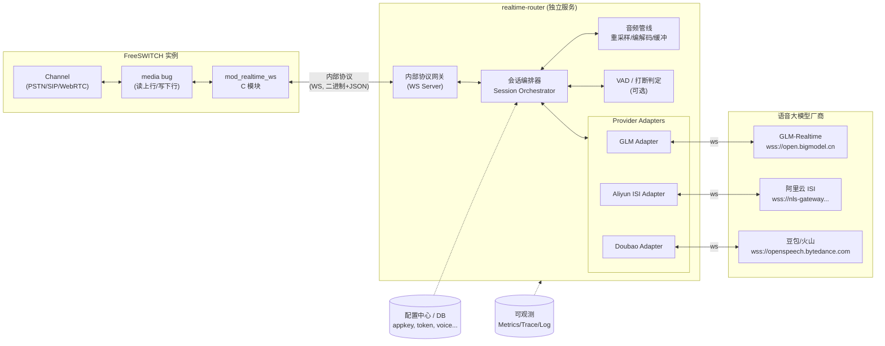
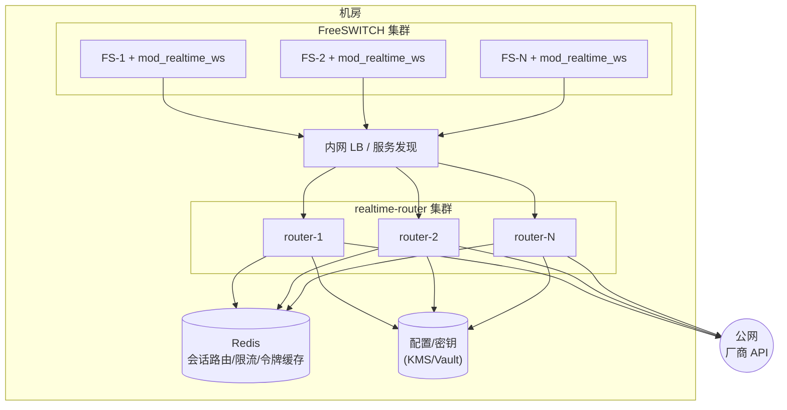

# 01 · 技术方案总览

## 1. 背景与目标

随着端到端（Speech-to-Speech, S2S）语音大模型的成熟，传统 "ASR → LLM → TTS" 三段式链路正在被单一实时模型取代。我们希望让 FreeSWITCH 承载的电话/SIP/WebRTC 通话能够直接接入各类实时语音大模型，实现自然、低时延、可打断的语音交互。

目标厂商（首批）：

| 厂商 | 产品 | 形态 | 接入文档 |
| --- | --- | --- | --- |
| 智谱 | GLM-Realtime | 端到端 S2S（OpenAI Realtime 风格事件协议） | https://docs.bigmodel.cn/cn/guide/models/sound-and-video/glm-realtime |
| 阿里云 | 智能语音交互 (ISI) | 流式 ASR（需叠加 TTS 才能端到端） | https://help.aliyun.com/zh/isi/developer-reference/websocket |
| 火山引擎 | 豆包端到端实时语音大模型 | 端到端 S2S（二进制事件协议） | https://www.volcengine.com/docs/6561/1594356 |

### 1.1 设计目标

- **统一抽象**：上层（FreeSWITCH/拨号计划）以一致的方式接入任意厂商，切换厂商无需改动呼叫流程。
- **低时延**：端到端首包音频 < 800ms（目标），打断响应 < 300ms。
- **可打断（barge-in）**：用户说话能即时打断 AI 播报。
- **高并发**：单 router 实例支撑 ≥ 500 路并发会话，水平可扩展。
- **可观测**：每路会话有完整的指标、日志、可选录音。
- **可扩展**：新增厂商只需实现一个 Provider Adapter，不改动核心。

### 1.2 非目标（首期不做）

- 视频通话/视频帧上报（GLM-Realtime 支持，但首期仅做音频）。
- 计费、配额管理（交由上层业务系统）。
- 模型微调/私有化部署适配。

## 2. 术语

| 术语 | 含义 |
| --- | --- |
| S2S | Speech-to-Speech，端到端语音大模型 |
| Provider / Vendor | 语音大模型厂商（GLM/阿里云/豆包） |
| Adapter | router 内针对某厂商协议的适配器 |
| Media Bug | FreeSWITCH 提供的媒体旁路机制，可读写通话音频帧 |
| VAD | Voice Activity Detection，语音活动检测 |
| Barge-in | 用户语音打断 AI 播报 |
| Uplink / 上行 | 用户语音 → 模型方向 |
| Downlink / 下行 | 模型音频 → 用户方向 |
| Turn | 一轮对话（一问一答） |

## 3. 总体架构

### 3.1 为什么拆成两个模块

| 关注点 | mod_realtime_ws（C，进程内） | realtime-router（独立服务，Go/Rust/C++） |
| --- | --- | --- |
| 职责 | 紧贴 FreeSWITCH 媒体面，采集/下发音频 | 业务面，协议适配、编排、路由 |
| 语言 | 必须 C（FreeSWITCH 模块 ABI） | 可选高生产力语言（推荐 Go） |
| 变更频率 | 低（稳定） | 高（频繁新增厂商/调参） |
| 崩溃影响 | 影响整台 FreeSWITCH | 仅影响 router，FreeSWITCH 不受牵连 |
| 扩展性 | 随 FreeSWITCH 实例 | 可独立水平扩展、灰度 |
| 依赖 | 不引入重型 SDK，保持 mod 轻量 | 可自由依赖各家 SDK / 加解压 / TLS |

**结论**：把"易变、重依赖、需快速迭代"的协议适配从 FreeSWITCH 进程隔离出去，是稳定性与迭代速度的最佳折中。mod 只做"哑管道 + 媒体处理"，router 做"大脑"。

### 3.2 模块职责详述

#### mod_realtime_ws（FreeSWITCH C 模块）

负责：

1. **媒体采集**：通过 `switch_core_media_bug_add` 旁路读取通话上行 PCM（L16），按帧（20ms/160 样本@8k 或 320 样本@16k）推送。
2. **媒体下发**：把 router 下发的模型音频写入通话下行（通过 media bug 写回或独立播放队列），含抖动缓冲（jitter buffer）。
3. **重采样**：FreeSWITCH 通道通常 8k/16k，模型多为 16k 输入 / 24k 输出（GLM）。可在 mod 侧用 `switch_resample` 做重采样（也可放 router，见 §3.3）。
4. **内部协议客户端**：与 router 建立 WebSocket 长连接，发送音频帧与控制事件，接收下行音频与控制事件。
5. **打断执行**：收到 router 的 `clear_playback`（打断）指令后，**立即清空本地下行播放缓冲**（这是打断低时延的关键，必须在 mod 侧执行）。
6. **生命周期**：随 channel 创建/销毁，处理挂机、转接等事件。
7. **暴露 API/App**：提供 `dialplan application`（如 `<action application="realtime_ws" data="provider=glm session_profile=xxx"/>`）与 `fsapi`/ESL 控制接口。
8. **上报事件**：通过 FreeSWITCH event 总线上报会话事件（转写文本、说话开始/结束、错误等），便于上层 IVR/CRM 联动。

不负责：厂商协议细节、鉴权、token 刷新、模型参数编排——全部交给 router。

#### realtime-router（独立服务）

负责：

1. **内部协议网关**：作为 WebSocket Server 接受来自多个 FreeSWITCH/mod 的连接，一个内部连接对应一路会话（或多路复用，见 §03 文档）。
2. **会话编排（Session Orchestrator）**：维护每路会话的状态机，组装 session 配置（音色、指令、VAD 策略、工具定义）。
3. **Provider 适配**：将统一内部事件 ↔ 各厂商协议互译（事件名、二进制封帧、base64、压缩等）。
4. **音频管线**：编解码（PCM/Opus/G711）、重采样、增益、可选 VAD、缓冲与节流（GLM 限制 ≤50QPS，推荐 100ms/帧）。
5. **打断决策**：根据 VAD/厂商 `speech_started` 事件决定何时向 mod 发 `clear_playback`，并向厂商发 `response.cancel`/`ChatTTSText interrupt`。
6. **鉴权与密钥管理**：JWT/Token 生成与刷新、appkey 管理、按租户隔离。
7. **连接池与容灾**：到厂商的连接复用、重连退避、熔断、故障切换（厂商降级）。
8. **路由分发**：根据策略（租户/被叫号码/AB 实验/成本/负载）选择厂商与模型。
9. **Function Call 编排**：接收模型工具调用，回调业务 webhook，回填结果。
10. **可观测**：指标、分布式追踪、结构化日志、可选录音落地。

### 3.3 关键边界决策（待评审拍板）

| 决策点 | 方案 A | 方案 B | 倾向 |
| --- | --- | --- | --- |
| 重采样位置 | mod 侧（贴近媒体，省带宽，传 16k 给 router） | router 侧（mod 透传原始 8k，router 统一处理） | **A**：降低 router CPU 与带宽；mod 已有 resample 能力 |
| 编解码 | 内部链路传 PCM L16（简单，带宽大） | 内部链路传 Opus（省带宽，增 CPU/时延） | 内网默认 **L16**；跨机房可选 Opus |
| VAD/打断判定 | router 用厂商 server_vad（最省事） | router 自带 VAD（厂商无关、可控） | 默认厂商 server_vad，**router 兜底 VAD** 用于打断 |
| 内部协议传输 | WebSocket（与 mod_audio_fork 生态一致） | gRPC 双向流 | **WebSocket**：FreeSWITCH 生态成熟、mod 实现简单 |

## 4. 部署拓扑

- mod 与 router **解耦部署**，通过内网 LB/服务发现连接，便于独立扩缩容与灰度。
- router 无状态化：会话态在内存 + Redis（用于跨实例路由与限流），实例故障时该路会话失败重试或挂断（首期不做会话迁移）。
- 出网统一经 router，便于集中管理厂商密钥与出口 IP 白名单。

## 5. 技术选型建议

| 组件 | 选型 | 理由 |
| --- | --- | --- |
| mod_realtime_ws | C + FreeSWITCH 模块 API + libwebsockets | 与 `mod_audio_fork`/`mod_verto` 同源，复用成熟 ws 客户端 |
| realtime-router | Go（推荐） / Rust | 高并发 I/O、协程模型、生态完善、gzip/ws/tls 开箱即用 |
| 内部传输 | WebSocket（二进制帧承载音频 + JSON 帧承载控制） | 简单、与 mod_audio_fork 协议风格一致 |
| 音频处理 | libsamplerate / speexdsp（重采样、VAD） | 成熟稳定 |
| 配置/密钥 | Vault / KMS + 本地缓存 | 安全合规 |
| 可观测 | Prometheus + OpenTelemetry + Loki | 标准云原生栈 |

## 6. 端到端时延预算（目标）

| 阶段 | 预算 |
| --- | --- |
| mod 采集 → router | < 30ms（内网） |
| router → 厂商（公网） | 20~60ms |
| 厂商模型处理（首包） | 300~600ms |
| 厂商 → router → mod 下发首包 | < 60ms |
| **端到端首响** | **< 800ms** |
| 打断（用户开口 → 停止播报） | **< 300ms** |

> 详见后续文档：[02-厂商协议分析](./02-厂商协议分析.md) · [03-内部协议与事件定义](./03-内部协议与事件定义.md) · [04-时序图](./04-时序图.md) · [05-会话状态机与错误处理](./05-会话状态机与错误处理.md) · [06-模块详细设计](./06-模块详细设计.md)
