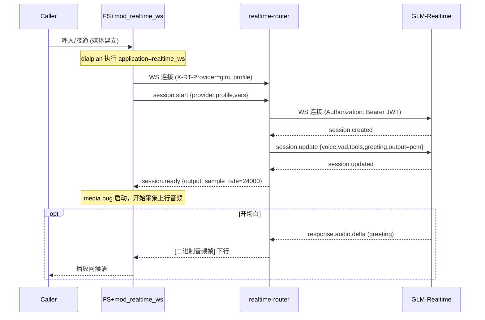
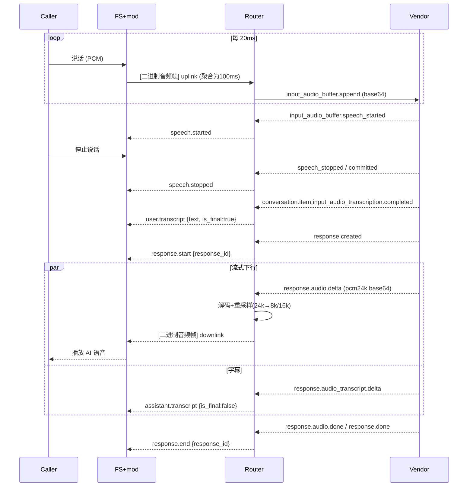
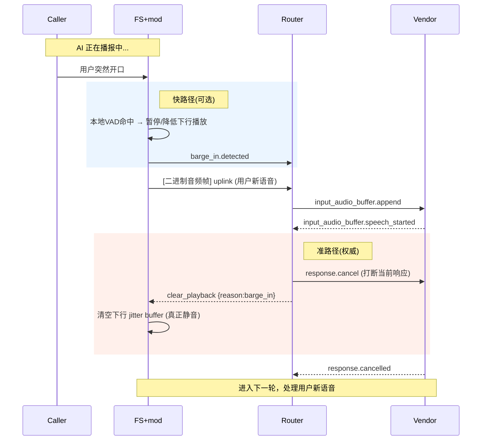
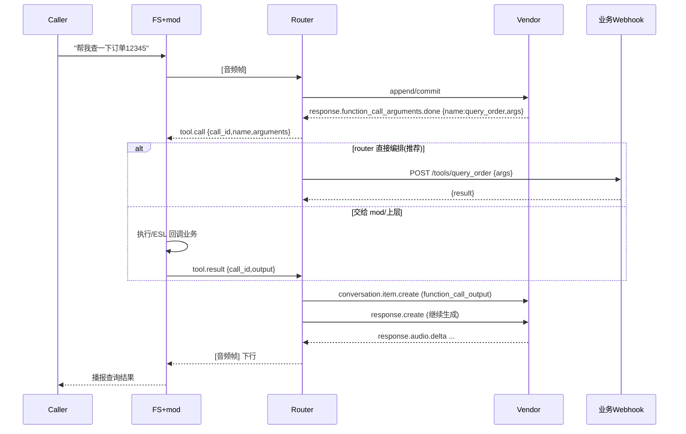
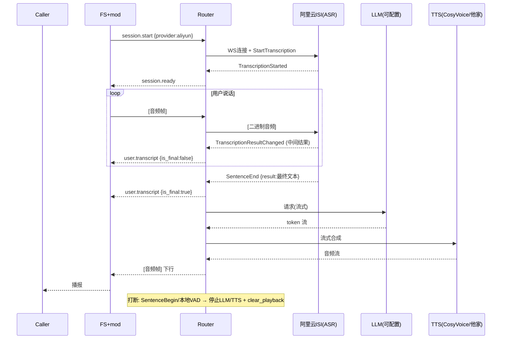
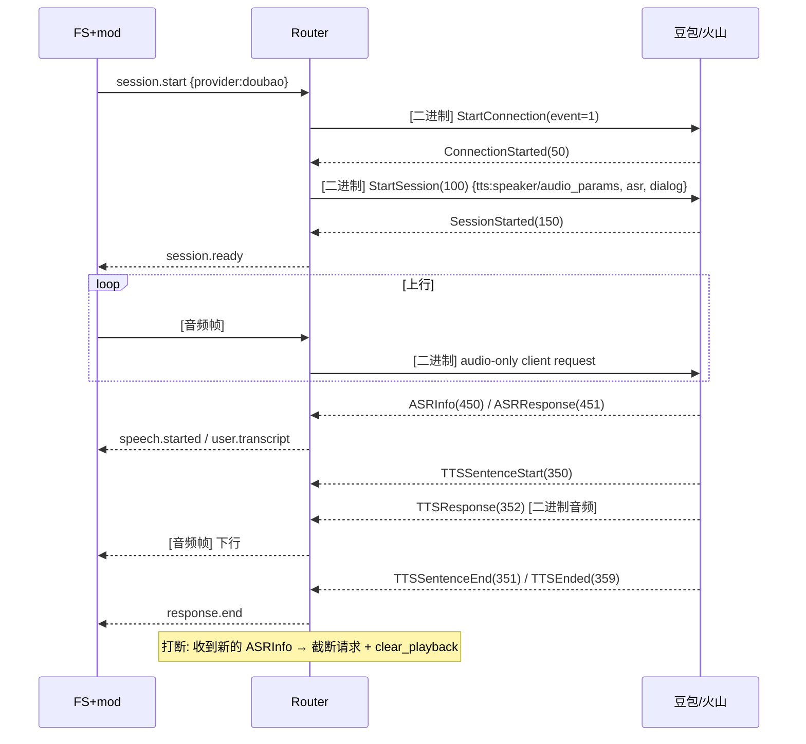
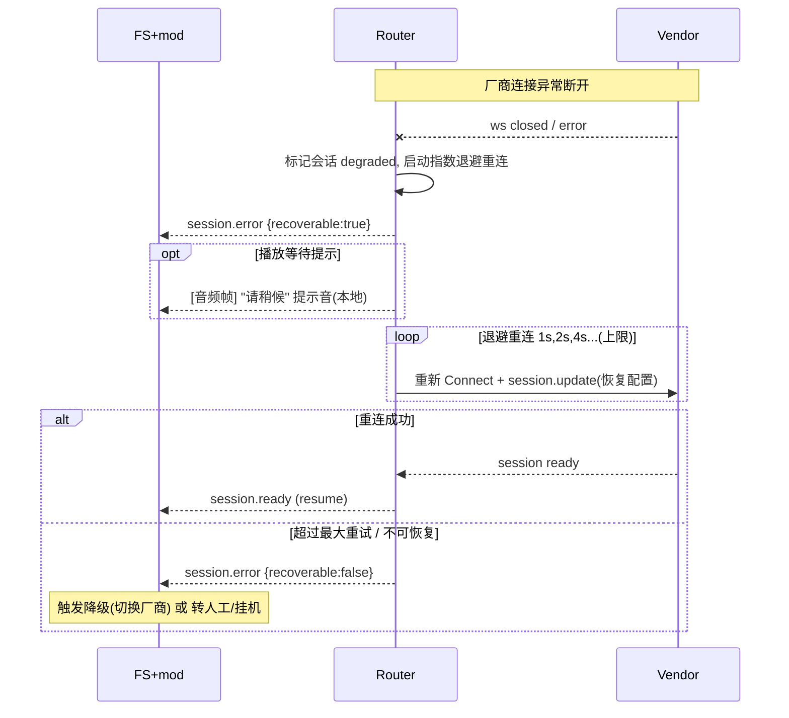
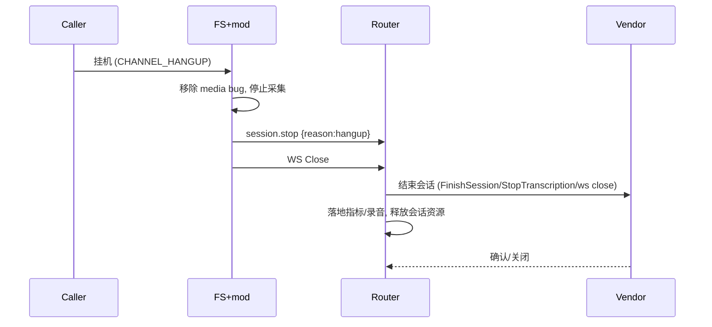

# 04 · 时序图

下列时序图覆盖核心交互流程。参与方：
- **Caller**：主叫用户（电话/SIP/WebRTC）
- **FS+mod**：FreeSWITCH 通道 + mod_realtime_ws
- **Router**：realtime-router
- **Vendor**：语音大模型厂商

## 1. 建链与会话初始化（以 GLM server_vad 为例）

## 2. 正常一轮对话（server_vad，端到端）

## 3. 打断 barge-in（双路径）

> 消抖：若快路径触发后在 `barge_in_confirm_timeout`(默认 400ms) 内未收到厂商 `speech_started`，router 不发 `clear_playback`，mod 恢复播放，避免噪声误打断。

## 4. Function Call（工具调用）

## 5. 阿里云 ISI 组合式端到端（ASR+LLM+TTS）

## 6. 豆包(火山) 端到端（二进制协议）

## 7. 异常与重连

## 8. 挂机与资源回收

