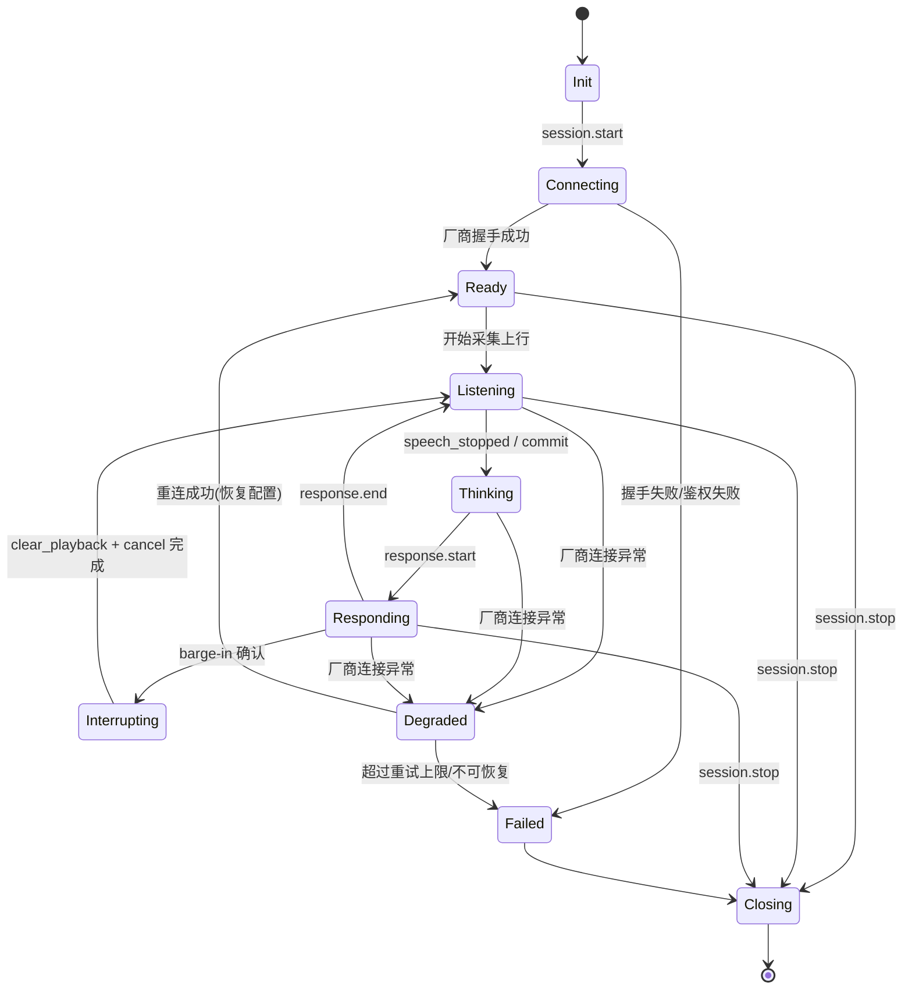

# 05 · 会话状态机、打断、错误处理与容灾

## 1. 会话状态机

router 为每路会话维护状态机；mod 维护一个轻量镜像（仅关心 PLAYING/IDLE/CLEARED 用于播放控制）。



状态说明：

| 状态 | 含义 | 允许的输入 |
| --- | --- | --- |
| Init | 刚创建 | session.start |
| Connecting | 正在连接厂商 | 取消/超时 |
| Ready | 就绪（含开场白） | 音频上行 |
| Listening | 监听用户说话 | 音频帧、VAD 事件 |
| Thinking | 已停说话，等模型 | cancel、超时 |
| Responding | 下行音频播放中 | barge-in、cancel |
| Interrupting | 打断处理中 | — |
| Degraded | 厂商断开，重连中 | 重连结果 |
| Failed | 失败终态前 | 降级/挂机 |
| Closing | 清理中 | — |

## 2. 打断（barge-in）控制细化

### 2.1 触发源优先级

1. 厂商 `speech_started`/`SentenceBegin`/`ASRInfo`（**权威**）。
2. router 内置 VAD（厂商无该能力或需更快时）。
3. mod 本地能量检测（**快路径**，仅做预暂停，不做最终决策）。

### 2.2 打断处理时序与参数

| 参数 | 默认 | 说明 |
| --- | --- | --- |
| `barge_in.local_energy_threshold` | -45 dBFS | mod 本地预暂停阈值 |
| `barge_in.confirm_timeout_ms` | 400 | 快路径预暂停后等待权威确认的窗口 |
| `barge_in.min_speech_ms` | 200 | 连续语音达到该时长才算真打断（消抖） |
| `barge_in.cancel_vendor` | true | 打断时是否向厂商发 cancel/截断 |
| `barge_in.cooldown_ms` | 300 | 两次打断之间的冷却，避免抖动 |

处理步骤：
1. 快路径预暂停下行播放（保留 buffer，不丢弃）。
2. 等待权威源确认（或 router VAD 连续命中 `min_speech_ms`）。
3. 确认 → router 发 `response.cancel`（厂商）+ `clear_playback`（mod 丢弃 buffer）；未确认且超时 → 恢复播放。

### 2.3 半双工/全双工说明

- 端到端模型多为全双工（边听边说），打断由模型/服务端托管。
- router 仍保留兜底打断，避免厂商 VAD 漏判导致 AI 抢话。

## 3. 错误分类与处理

| 类别 | 例子 | 处理 |
| --- | --- | --- |
| 鉴权错误 | token 过期、appkey 错误 | 刷新 token 重连；连续失败→Failed，告警 |
| 限流 | GLM ≤50QPS、并发超额 | 上行节流/排队；并发超额→排队或降级 |
| 网络抖动 | ws 短暂断开 | 指数退避重连，恢复会话配置 |
| 协议错误 | 非法事件、解析失败 | 记录 raw，多数可恢复；致命则 Failed |
| 模型错误 | 厂商内部错误事件 | 重试当前轮；多次失败提示用户/降级 |
| 媒体错误 | 重采样失败、缓冲溢出 | 丢帧+告警，保活会话 |

### 3.1 重连退避

- 退避序列：1s, 2s, 4s, 8s, 16s（带 ±20% 抖动），上限 5 次（可配）。
- 重连成功后必须**重放会话配置**（session.update/StartSession/StartTranscription），并尽量恢复对话上下文（厂商支持时）。
- 重连期间：上行音频缓存有限窗口（如 2s）或丢弃；下行播放本地"请稍候"提示音（可配）。

### 3.2 降级（Failover）策略

```mermaid
flowchart LR
    P[主厂商失败] --> C{降级开关?}
    C -- 关 --> H[转人工/挂机/提示]
    C -- 开 --> S[选择备用厂商]
    S --> R[重建会话(新厂商)]
    R --> OK{成功?}
    OK -- 是 --> Resume[继续对话]
    OK -- 否 --> H
```

- 路由策略可配置主备厂商（如 GLM 主、豆包备）。
- 降级会丢失原厂商上下文，需用本地维护的"对话摘要/历史"在新厂商 `instructions` 中重建（best-effort）。

## 4. 背压与流控

- **上行**：mod→router 用 WS，router 内对厂商上行做令牌桶（GLM ≤50QPS，即 ≥20ms/帧聚合为 100ms）。若厂商侧拥塞，丢弃最旧上行帧并打点（语音实时性优先于完整性）。
- **下行**：厂商→router→mod。mod 端 jitter buffer 上限（如 400ms），超限丢弃最旧帧或加速播放，防止时延累积。
- **WS 缓冲水位**：监控发送队列长度，超阈值触发流控/告警。

## 5. 超时与保活

| 超时 | 默认 | 动作 |
| --- | --- | --- |
| 厂商握手超时 | 5s | Failed/降级 |
| 首响超时（response 无音频） | 8s | 提示+重试当前轮 |
| 静默超时（用户长时间不说话） | 可配(如 20s) | 播放追问或挂机 |
| 会话最大时长 | 可配(GLM 音频~2分钟记忆) | 提示续接/重置上下文 |
| WS 心跳 | 15s ping | 2 次无 pong 判定断开 |

## 6. 幂等与有序

- 音频帧 `seq` 单调递增，乱序/重复由接收方按 seq 处理。
- 控制事件 `id` 去重；`clear_playback` 携带 `upto_seq` 可精确丢弃到某帧，避免误清新到达音频。

## 7. 录音与合规（可选）

- router 可旁路落地双向 PCM（上行/下行分轨）用于质检，受租户开关与合规策略控制。
- 转写文本落地（脱敏后）用于 CDR/质检。
- 密钥不落日志；音频/文本存储加密、按保留期清理。
