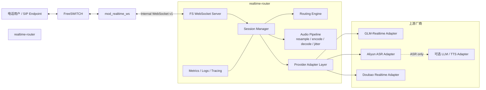
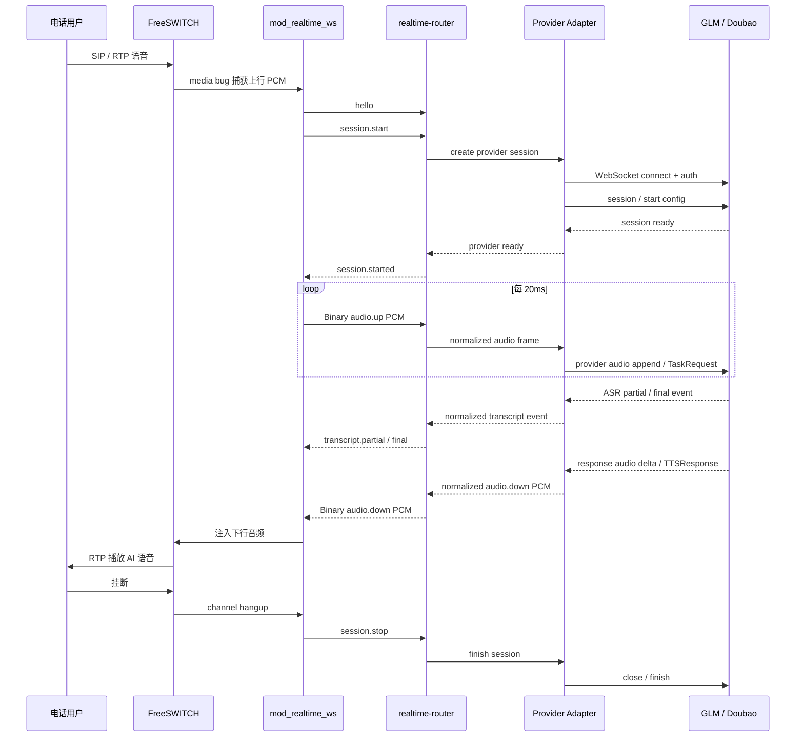
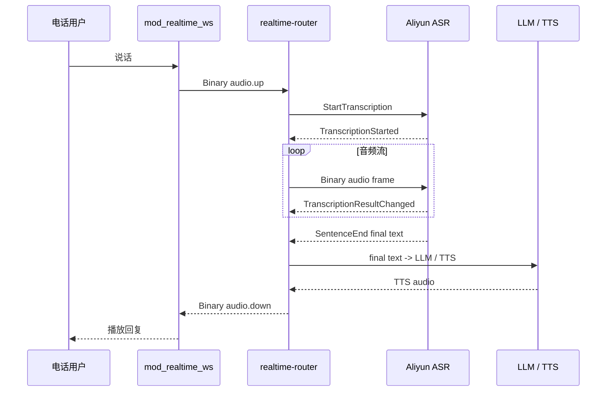
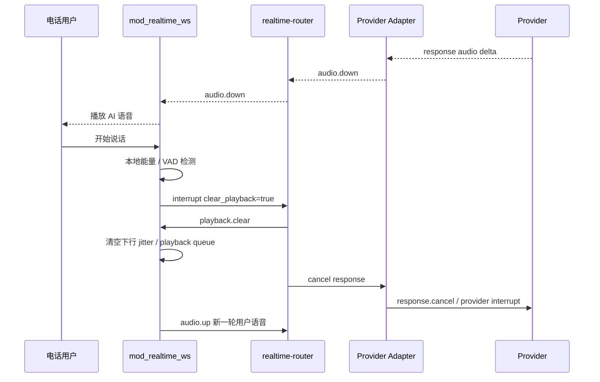
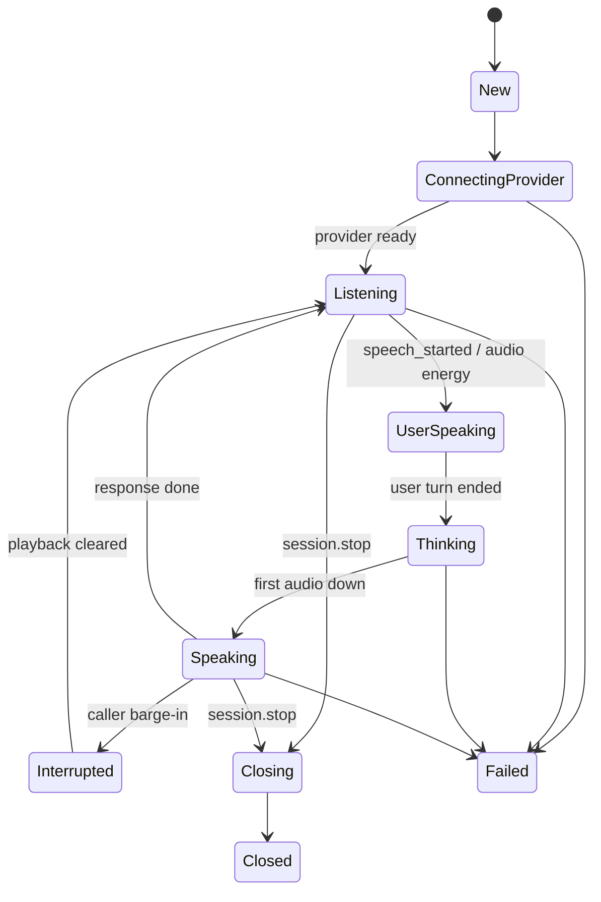

# mod_realtime_ws 与 realtime-router 技术方案

版本：v0.1
状态：评审稿
目标：为 FreeSWITCH 接入端到端实时语音大模型定义模块边界、技术架构、时序、内部 WebSocket 协议、消息事件与厂商适配方案。

## 1. 背景与目标

本方案计划建设两个核心模块：

1. `mod_realtime_ws`
   - 运行在 FreeSWITCH 内部。
   - 负责电话侧实时音频上报。
   - 负责接收 AI 下行音频并注入通话。
   - 负责通话生命周期、DTMF、挂断、打断等事件上报。

2. `realtime-router`
   - 作为独立服务部署。
   - 负责管理来自 FreeSWITCH 的内部 WebSocket 连接。
   - 负责对接 GLM-Realtime、阿里云智能语音交互、豆包端到端实时语音大模型等上游厂商。
   - 负责语音流路由、协议转换、音频格式转换、状态机、容灾、观测与限流。

设计原则：

- FreeSWITCH 模块只做媒体接入和通话控制，不直接耦合厂商协议。
- `realtime-router` 统一管理厂商差异，形成可扩展 provider adapter。
- 内部协议使用稳定、低开销、可观测的 WebSocket 协议。
- 电话实时性优先，延迟和打断体验优先于完整播放旧音频。

## 2. 厂商协议摘要

### 2.1 GLM-Realtime

GLM-Realtime 基于 WebSocket，官方实时接口地址为：

```text
wss://open.bigmodel.cn/api/paas/v4/realtime
```

鉴权通过 WebSocket 建联 Header 中的 `Authorization: Bearer ...` 完成。GLM 支持 `session.update` 配置会话，`input_audio_buffer.append` 上传 base64 编码音频，`response.audio.delta` 返回 base64 编码音频增量，并支持 `response.cancel` 取消响应。[GLM-Realtime SDK 文档](https://raw.githubusercontent.com/MetaGLM/glm-realtime-sdk/main/GLM-Realtime-doc-for-llm.md)

GLM AsyncAPI 描述其会话配置支持 `glm-realtime-flash`、`glm-realtime-air`，输入音频格式支持 `wav`、`pcm`，PCM 输入格式需要标注采样率，例如 `pcm16`、`pcm24`；输出音频格式当前为 PCM，采样率 24kHz、单声道、16 位深。[GLM AsyncAPI](https://docs.bigmodel.cn/cn/asyncapi/realtime)

### 2.2 阿里云智能语音交互

阿里云智能语音交互 WebSocket 文档描述的是实时语音识别能力。控制指令和服务端事件使用 WebSocket Text Frame JSON，音频流使用 Binary Frame 上传。[阿里云 WebSocket 文档](https://help.aliyun.com/zh/isi/developer-reference/websocket)

外网访问地址：

```text
wss://nls-gateway-cn-shanghai.aliyuncs.com/ws/v1?token=<token>
```

其支持的输入格式包括 PCM、PCM 编码 WAV、OGG/OPUS、OGG/SPEEX、AMR、MP3、AAC；支持 8000Hz 与 16000Hz 采样率。[阿里云 WebSocket 文档](https://help.aliyun.com/zh/isi/developer-reference/websocket)

注意：该文档主要是 ASR-only。若要形成电话语音助手，需要在 `realtime-router` 内串联：

```text
阿里云 ASR -> LLM -> TTS -> FreeSWITCH
```

### 2.3 豆包端到端实时语音大模型

豆包端到端实时语音大模型 RealtimeAPI 基于 WebSocket，支持低延迟、多模式、边发送边接收的流式语音交互。[火山引擎豆包 Realtime API](https://www.volcengine.com/docs/6561/1594356)

官方文档搜索结果显示连接地址为：

```text
wss://openspeech.bytedance.com/api/v3/realtime/dialogue
```

建联 Header 包括：

```http
X-Api-App-ID: <app_id>
X-Api-Access-Key: <access_key>
X-Api-Resource-Id: volc.speech.dialog
X-Api-App-Key: PlgvMymc7f3tQnJ6
X-Api-Connect-Id: <uuid>
```

豆包使用 WebSocket 二进制协议。客户端事件包含 `StartConnection`、`StartSession`、`TaskRequest`、`FinishSession`、`FinishConnection`；服务端事件包含 `ConnectionStarted`、`SessionStarted`、`ASRInfo`、`ASRResponse`、`ASREnded`、`TTSSentenceStart`、`TTSResponse`、`TTSEnded` 等。[火山引擎豆包 Realtime API](https://www.volcengine.com/docs/6561/1594356)

## 3. 总体架构



## 4. 模块职责

### 4.1 mod_realtime_ws

`mod_realtime_ws` 是 FreeSWITCH 侧媒体接入模块。

职责：

- 捕获通话上行音频。
- 将音频规范化为内部 PCM 帧并通过 WebSocket 上报。
- 接收 router 返回的下行 PCM 音频。
- 做下行 jitter buffer。
- 将下行音频注入 FreeSWITCH write path。
- 上报通话开始、挂断、DTMF、静音、暂停、恢复、打断等事件。
- 在本地检测用户打断时立即清空播放队列，减少残留播报。

设计约束：

- FreeSWITCH 媒体回调中禁止做网络阻塞操作。
- 上行音频先写入 ring buffer，由独立 WebSocket 线程发送。
- 下行音频由 WebSocket 接收线程写入 jitter queue，由媒体线程消费。
- 网络异常不应阻塞或拖垮 FreeSWITCH 核心媒体线程。

### 4.2 realtime-router

`realtime-router` 是协议、路由和厂商适配中心。

职责：

- 对 FreeSWITCH 暴露内部 WebSocket Server。
- 维护通话 session 与 provider session 映射。
- 选择上游 provider。
- 将内部音频帧转换为厂商要求的格式。
- 将厂商事件规范化为内部事件。
- 处理 ASR、LLM、TTS 级联链路。
- 实现打断、取消、回合隔离、迟到音频丢弃。
- 实现限流、熔断、fallback、metrics、trace、日志脱敏。

## 5. 内部 WebSocket 协议

协议名：`realtime-ws.v1`

推荐连接地址：

```text
ws://127.0.0.1:18080/v1/realtime
```

推荐 Header：

```http
Authorization: Bearer <internal-token>
X-Realtime-Node: freeswitch-01
X-Realtime-Subprotocol: realtime-ws.v1
```

### 5.1 Frame 类型

| Frame 类型 | 用途 |
| --- | --- |
| Text JSON | 会话控制、状态事件、错误事件、ASR 文本、路由配置 |
| Binary | 上行与下行音频帧 |

### 5.2 JSON Envelope

```json
{
  "v": 1,
  "type": "session.start",
  "session_id": "rt-uuid",
  "call_id": "freeswitch-uuid",
  "seq": 1,
  "ts_ms": 1730000000000,
  "trace_id": "trace-uuid",
  "payload": {}
}
```

| 字段 | 类型 | 说明 |
| --- | --- | --- |
| `v` | integer | 协议版本 |
| `type` | string | 事件类型 |
| `session_id` | string | 实时会话 ID |
| `call_id` | string | FreeSWITCH channel UUID |
| `seq` | uint64 | 单连接递增序号 |
| `ts_ms` | int64 | 发送端毫秒时间戳 |
| `trace_id` | string | 链路追踪 ID |
| `payload` | object | 事件载荷 |

## 6. mod_realtime_ws 到 realtime-router 事件

### 6.1 hello

```json
{
  "v": 1,
  "type": "hello",
  "seq": 1,
  "ts_ms": 1730000000000,
  "payload": {
    "module": "mod_realtime_ws",
    "module_version": "0.1.0",
    "freeswitch_version": "1.10.x",
    "supported_audio": ["pcm_s16le"],
    "supported_frame_ms": [10, 20, 40]
  }
}
```

### 6.2 session.start

```json
{
  "v": 1,
  "type": "session.start",
  "session_id": "rt-001",
  "call_id": "fs-channel-uuid",
  "seq": 2,
  "ts_ms": 1730000000100,
  "payload": {
    "tenant_id": "tenant-a",
    "route": {
      "provider": "glm",
      "model": "glm-realtime-flash",
      "fallback": ["doubao"]
    },
    "telephony": {
      "caller": "1001",
      "callee": "955xx",
      "direction": "inbound",
      "sip_call_id": "sip-call-id"
    },
    "audio": {
      "encoding": "pcm_s16le",
      "sample_rate": 16000,
      "channels": 1,
      "frame_ms": 20
    },
    "bot": {
      "instructions": "你是一个电话客服助手。",
      "voice": "default",
      "language": "zh-CN",
      "vad": "server"
    }
  }
}
```

### 6.3 audio.commit

用于 client VAD 模式或按键结束说话。

```json
{
  "v": 1,
  "type": "audio.commit",
  "session_id": "rt-001",
  "call_id": "fs-channel-uuid",
  "seq": 300,
  "ts_ms": 1730000003000,
  "payload": {
    "reason": "vad_end"
  }
}
```

### 6.4 interrupt

```json
{
  "v": 1,
  "type": "interrupt",
  "session_id": "rt-001",
  "call_id": "fs-channel-uuid",
  "seq": 400,
  "ts_ms": 1730000004000,
  "payload": {
    "reason": "caller_speech",
    "clear_playback": true
  }
}
```

### 6.5 dtmf

```json
{
  "v": 1,
  "type": "dtmf",
  "session_id": "rt-001",
  "call_id": "fs-channel-uuid",
  "seq": 410,
  "ts_ms": 1730000004100,
  "payload": {
    "digit": "1",
    "duration_ms": 120
  }
}
```

### 6.6 session.stop

```json
{
  "v": 1,
  "type": "session.stop",
  "session_id": "rt-001",
  "call_id": "fs-channel-uuid",
  "seq": 999,
  "ts_ms": 1730000099999,
  "payload": {
    "reason": "hangup"
  }
}
```

## 7. realtime-router 到 mod_realtime_ws 事件

### 7.1 session.started

```json
{
  "v": 1,
  "type": "session.started",
  "session_id": "rt-001",
  "call_id": "fs-channel-uuid",
  "seq": 1,
  "ts_ms": 1730000000200,
  "payload": {
    "provider": "glm",
    "provider_session_id": "provider-session-id",
    "audio": {
      "encoding": "pcm_s16le",
      "sample_rate": 16000,
      "channels": 1
    }
  }
}
```

### 7.2 state.changed

```json
{
  "v": 1,
  "type": "state.changed",
  "session_id": "rt-001",
  "call_id": "fs-channel-uuid",
  "seq": 2,
  "ts_ms": 1730000000300,
  "payload": {
    "from": "connecting",
    "to": "listening"
  }
}
```

### 7.3 transcript.partial

```json
{
  "v": 1,
  "type": "transcript.partial",
  "session_id": "rt-001",
  "call_id": "fs-channel-uuid",
  "seq": 30,
  "ts_ms": 1730000003000,
  "payload": {
    "role": "user",
    "text": "我想查一下",
    "provider": "aliyun"
  }
}
```

### 7.4 transcript.final

```json
{
  "v": 1,
  "type": "transcript.final",
  "session_id": "rt-001",
  "call_id": "fs-channel-uuid",
  "seq": 31,
  "ts_ms": 1730000003500,
  "payload": {
    "role": "user",
    "text": "我想查一下订单状态",
    "confidence": 0.93,
    "provider": "aliyun"
  }
}
```

### 7.5 playback.clear

```json
{
  "v": 1,
  "type": "playback.clear",
  "session_id": "rt-001",
  "call_id": "fs-channel-uuid",
  "seq": 50,
  "ts_ms": 1730000005000,
  "payload": {
    "reason": "barge_in"
  }
}
```

### 7.6 error

```json
{
  "v": 1,
  "type": "error",
  "session_id": "rt-001",
  "call_id": "fs-channel-uuid",
  "seq": 99,
  "ts_ms": 1730000009900,
  "payload": {
    "code": "PROVIDER_TIMEOUT",
    "message": "provider first audio timeout",
    "retryable": true,
    "provider": "glm"
  }
}
```

## 8. 内部 Binary 音频帧

内部音频帧建议直接使用 WebSocket Binary 传输，避免 base64 带来的 CPU 和带宽额外开销。

### 8.1 Header v1

所有整数使用 network byte order。

```c
struct RealtimeAudioFrameHeaderV1 {
    char     magic[2];        // "RW"
    uint8_t  version;         // 1
    uint8_t  frame_type;      // 1=audio.up, 2=audio.down
    uint16_t header_len;      // sizeof(header)
    uint16_t flags;           // bit0=end_of_turn, bit1=barge_in_marker
    uint32_t seq;
    uint64_t pts_ms;
    uint32_t sample_rate;     // 8000/16000/24000/48000
    uint16_t channels;        // 1
    uint16_t frame_ms;        // 10/20/40
    uint32_t payload_len;
};
```

Payload：

```text
PCM S16LE mono bytes
```

### 8.2 推荐帧大小

| 采样率 | 帧长 | 样本数 | PCM S16LE 字节数 |
| --- | ---: | ---: | ---: |
| 8000 | 20ms | 160 | 320 |
| 16000 | 20ms | 320 | 640 |
| 24000 | 20ms | 480 | 960 |

## 9. 时序图

### 9.1 端到端语音对话



### 9.2 阿里云 ASR-only 级联链路



### 9.3 用户打断 AI 播放



## 10. Provider Adapter 设计

### 10.1 GLM Adapter

GLM 会话配置示例：

```json
{
  "type": "session.update",
  "session": {
    "model": "glm-realtime-flash",
    "input_audio_format": "pcm16",
    "output_audio_format": "pcm",
    "turn_detection": {
      "type": "server_vad"
    },
    "modalities": ["text", "audio"],
    "instructions": "你是一个电话客服助手。",
    "beta_fields": {
      "chat_mode": "audio",
      "tts_source": "e2e"
    }
  }
}
```

内部事件到 GLM 事件映射：

| 内部事件 | GLM 事件 |
| --- | --- |
| `session.start` | `session.update` |
| `audio.up` | `input_audio_buffer.append` |
| `audio.commit` | `input_audio_buffer.commit` |
| `interrupt` | `response.cancel` |
| `session.stop` | close WebSocket |

GLM 事件到内部事件映射：

| GLM 事件 | 内部事件 |
| --- | --- |
| `session.updated` | `session.started` |
| `input_audio_buffer.speech_started` | `state.changed: user_speaking` |
| `conversation.item.input_audio_transcription.completed` | `transcript.final` |
| `response.audio_transcript.delta` | `assistant.transcript.partial` |
| `response.audio.delta` | Binary `audio.down` |
| `response.done` | `state.changed: speaking -> listening` |
| `error` | `error` |

### 10.2 阿里云 Adapter

阿里云启动指令示例：

```json
{
  "header": {
    "message_id": "32hex",
    "task_id": "32hex",
    "namespace": "SpeechTranscriber",
    "name": "StartTranscription",
    "appkey": "your-appkey"
  },
  "payload": {
    "format": "pcm",
    "sample_rate": 16000,
    "enable_intermediate_result": true,
    "enable_punctuation_prediction": true,
    "enable_inverse_text_normalization": true
  }
}
```

阿里云事件到内部事件映射：

| 阿里云事件 | 内部事件 |
| --- | --- |
| `TranscriptionStarted` | `provider.ready` |
| `SentenceBegin` | `state.changed: user_speaking` |
| `TranscriptionResultChanged` | `transcript.partial` |
| `SentenceEnd` | `transcript.final` |
| `TranscriptionCompleted` | `provider.completed` |

### 10.3 豆包 Adapter

内部事件到豆包事件映射：

| 内部事件 | 豆包事件 |
| --- | --- |
| `session.start` | `StartConnection` -> `StartSession` |
| `audio.up` | `TaskRequest` |
| `interrupt` | `ClientInterrupt` / `CancelSession`，需联调校准 |
| `session.stop` | `FinishSession`，必要时 `FinishConnection` |

豆包事件到内部事件映射：

| 豆包事件 | 内部事件 |
| --- | --- |
| `ConnectionStarted` | `provider.connected` |
| `SessionStarted` | `session.started` |
| `ASRInfo` | `state.changed: user_speaking` |
| `ASRResponse` | `transcript.partial` / `transcript.final` |
| `ASREnded` | `state.changed: user_turn_ended` |
| `TTSSentenceStart` | `state.changed: speaking` |
| `TTSResponse` | Binary `audio.down` |
| `TTSEnded` | `state.changed: listening` |
| `SessionFinished` | `session.ended` |

## 11. Session 状态机



## 12. 打断策略

默认启用本地打断检测：

1. `mod_realtime_ws` 在 AI 播放期间检测到 caller 语音能量超过阈值并持续 N ms。
2. `mod_realtime_ws` 立即发送 `interrupt`。
3. `mod_realtime_ws` 本地清空 playback queue。
4. `realtime-router` 通知 provider 取消当前回复。
5. `realtime-router` 使用 `round_id` / `response_id` 丢弃旧响应迟到音频。

Provider 支持情况：

- GLM：使用 `response.cancel`。
- 豆包：使用打断或取消事件，字段需结合最新官方文档和联调结果校准。
- 阿里云 ASR-only：打断主要作用于 router 内部 TTS 播放链路。

## 13. 音频处理方案

### 13.1 内部标准格式

推荐内部统一：

```text
PCM S16LE
mono
16kHz
20ms frame
```

原因：

- 电话侧 8k / 16k 常见。
- 16k 对 ASR 兼容性较好。
- 阿里云支持 8000Hz 与 16000Hz。
- GLM 支持 PCM 输入，并要求 PCM 格式标注采样率。

### 13.2 下行音频处理

Provider 输出归一化流程：

```text
provider audio -> decode -> resample -> PCM S16LE -> internal audio.down -> mod_realtime_ws -> FreeSWITCH codec
```

`realtime-router` 负责将 GLM / 豆包等上游音频转换为内部 PCM。`mod_realtime_ws` 只做必要的最终重采样与 FreeSWITCH 写入。

## 14. 路由策略

配置示例：

```yaml
routes:
  default:
    provider: glm
    model: glm-realtime-flash
    fallback:
      - doubao

  aliyun_asr_chain:
    provider: aliyun_asr
    llm: glm_text
    tts: doubao_tts

tenants:
  tenant-a:
    default_route: default
    max_concurrent_calls: 100
    allowed_providers:
      - glm
      - doubao
      - aliyun_asr
```

路由因子：

- 租户。
- 呼入号码。
- 主叫号码。
- 语言。
- 模型。
- 厂商健康状态。
- 成本优先或延迟优先。
- 是否需要端到端语音。
- 是否只需要 ASR。

## 15. 安全设计

### 15.1 FreeSWITCH 到 router

- 优先内网通信。
- 支持内部 Bearer Token。
- 可选 mTLS。
- 限制来源 IP。
- 每个 `call_id` 只允许一个活跃 session。

### 15.2 router 到厂商

- 所有厂商 API Key 只存放在 `realtime-router`。
- FreeSWITCH dialplan 不出现厂商密钥。
- 支持按 tenant 隔离密钥。
- 日志必须脱敏。

### 15.3 数据保护

- 默认不落原始音频。
- 如需调试录音，必须显式开启。
- transcript 日志支持脱敏。

## 16. 可靠性与容错

### 16.1 Backpressure

上行：

- `mod_realtime_ws` ring buffer 超水位时优先丢弃静音帧。
- 非静音帧丢弃必须记录 metric。

下行：

- playback queue 超水位时丢弃过期帧。
- 保持实时性优先，不追求完整播放旧音频。

### 16.2 Provider 失败处理

| 阶段 | 策略 |
| --- | --- |
| 建连失败 | fallback 到备用 provider |
| 会话开始前失败 | 可透明重试 |
| 用户一轮语音中失败 | 不建议无损切换，可结束本轮并提示系统繁忙 |
| AI 播放中失败 | 停止播放，回到 listening 或挂断 |
| 连续失败 | 熔断 provider |

### 16.3 序号与回合隔离

所有关键事件建议携带：

- `seq`
- `round_id`
- `response_id`
- `provider_session_id`

用途：

- 防止旧响应迟到。
- 防止打断后旧音频继续播放。
- 防止 provider reconnect 后事件串线。

## 17. FreeSWITCH 接入形态

### 17.1 Dialplan Application

```xml
<action application="realtime_ws" data="start route=default tenant=tenant-a"/>
```

### 17.2 API 命令

```text
uuid_realtime_ws <uuid> start route=default tenant=tenant-a
uuid_realtime_ws <uuid> stop
uuid_realtime_ws <uuid> pause
uuid_realtime_ws <uuid> resume
```

### 17.3 Channel Variables

```text
realtime_ws_route=default
realtime_ws_tenant=tenant-a
realtime_ws_provider=glm
realtime_ws_language=zh-CN
realtime_ws_voice=tongtong
realtime_ws_vad=server
realtime_ws_interrupt=true
```

## 18. MVP 范围

第一阶段建议实现：

1. `mod_realtime_ws`
   - 捕获 caller 上行 PCM。
   - 内部 WebSocket 连接 router。
   - 接收下行 PCM 并播放。
   - 支持 hangup cleanup。
   - 支持 playback clear。

2. `realtime-router`
   - 支持单 provider。
   - 支持内部协议 `session.start`、`audio.up`、`audio.down`、`interrupt`、`session.stop`。
   - 支持基础重采样。
   - 支持日志和 Prometheus metrics。

3. Provider Adapter
   - 优先 GLM 或豆包。
   - 阿里云 ASR-only 作为第二阶段接入。

## 19. 待评审问题

1. 第一阶段优先接哪个 provider？
   - 端到端语音对话：建议优先 GLM 或豆包。
   - 稳定转写优先：建议先接阿里云 ASR。

2. `realtime-router` 技术栈选型：
   - Go：实现快、部署简单、WebSocket 和音频 pipeline 成熟。
   - Rust：延迟和内存安全更好，但开发复杂度更高。
   - C/C++：与 FreeSWITCH 生态一致，但 router 业务复杂度更高。

3. 是否引入独立 VAD？
   - MVP 可先用 provider server VAD + 本地能量检测。
   - 后续可接 WebRTC VAD 或 Silero VAD。

4. 阿里云链路定位：
   - ASR-only provider。
   - 或与外部 LLM/TTS 组成级联 provider。

5. 是否需要保存会话历史？
   - MVP 建议只保留内存态。
   - 后续按 tenant 配置是否落库。

## 20. 资料来源

- [GLM-Realtime SDK 文档](https://raw.githubusercontent.com/MetaGLM/glm-realtime-sdk/main/GLM-Realtime-doc-for-llm.md)
- [GLM AsyncAPI - 音视频通话](https://docs.bigmodel.cn/cn/asyncapi/realtime)
- [阿里云智能语音交互 WebSocket 文档](https://help.aliyun.com/zh/isi/developer-reference/websocket)
- [火山引擎豆包端到端实时语音大模型 API 接入文档](https://www.volcengine.com/docs/6561/1594356)
